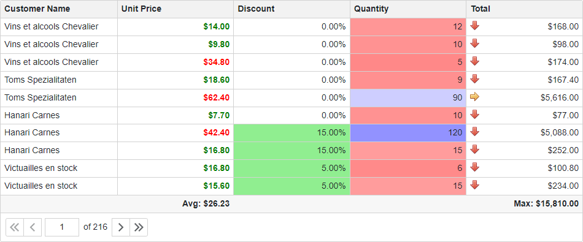

<!-- default badges list -->

<!-- default badges end -->

# Grid for Blazor - Customize cell appearance based on custom conditions

The example demonstrates how to customize appearance of the [DevExpress Blazor Grid](https://docs.devexpress.com/Blazor/DevExpress.Blazor.DxGrid) elements based on custom conditions.

The example code uses [summary items](https://docs.devexpress.com/Blazor/DevExpress.Blazor.DxGridSummaryItem) to calculate minimum, maximum, and average column values. Based on cell and summary item values, the [CustomizeElement](https://docs.devexpress.com/Blazor/DevExpress.Blazor.DxGrid.CustomizeElement) event handler changes cell appearance in the following columns:

**Discount Column**  
Cells that display positive values are colored green.

**Unit Price Column**  
All cell values are bold. If a cell value is lower than the column average value, the cell's font color is green; otherwise, the font color is red.

**Quantity Column**  
If a cell value is lower than the column average value, the cell is colored in a shade of red; otherwise, the cell is colored in a shade of blue. The more a cell value differs from the average value, the brighter the cell color. If a cell value is equal to the average value, the cell color is white.

**Total Column**  
A cell displays one of the following arrows based on its value:
* A red pointing down arrow - for small values.
* A yellow pointing left arrow - for medium values.
* A green pointing up arrow - for large values.

## Files to Review

* [Index.razor](./CS/GridConditionalFormatting/Pages/Index.razor)

## Documentation

* [Custom Element Appearance](https://docs.devexpress.com/Blazor/DevExpress.Blazor.DxGrid.CustomizeElement)
